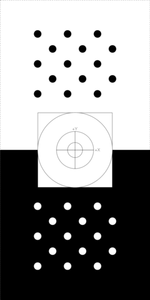
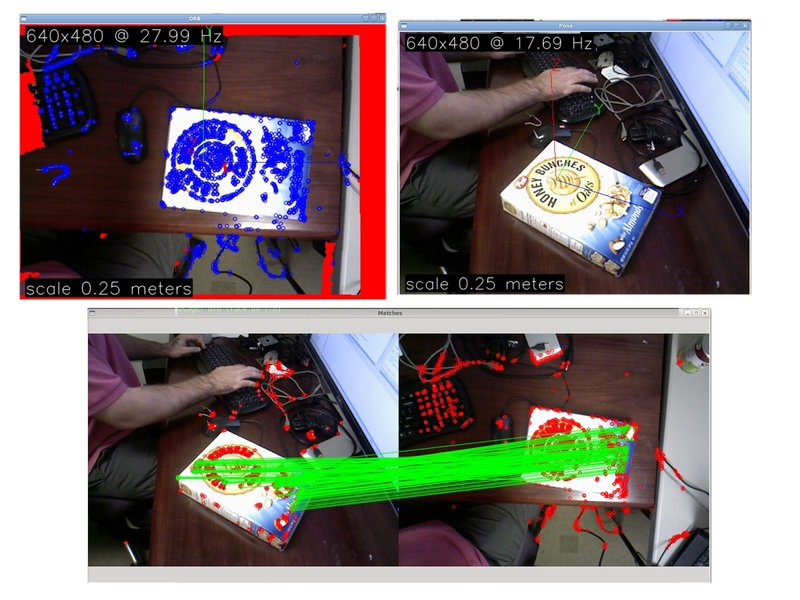

Data Capture
============

.. contents::

Object capture tools.

.. highlight:: ectosh

setup
-----
Capture is view based, and requires a fiducial that is rigidly attached to
the object being observed.  This enables relatively accurate view point pose estimation,
a consistent object coordinate frame, and simple object/background segmentation.
The setup assumes that you have an RGB Depth device, such as the Kinect.

We have two methods of object captures, that have roughly equivalent quality results.

Dot Pattern
+++++++++++

.. _capture_board:

On type of fiducial usable by object capture is the dot pattern. An svg is available here
:download:`capture_board_big_5x3.svg`

  The default capture board uses circle pattern based fiducial markers,
  one black on white, the other inverted, so that two may be detected in
  the scene and allow for pose estimation in the presence of occlusion
  of one of the markers.

Get a full size printing of the above fiducial marker and mount it to flat surface,
possibly on a lazy susan. http://en.wikipedia.org/wiki/Lazy_Susan

ORB Template
++++++++++++

.. _orb_template:

   
   Once a canonical frame, or "template" is captured of a textured planar surface, it may
   be used as if it were a fiducial, giving a pose and segmentation prior.

If you are not inclined to print something out, you may use any highly textured planar surface.
This involves capturinga  a connonical view of said surface, and then it may be used to establish an
object coordinate system, and perform segmentation.

ROS OpenNI Startup
^^^^^^^^^^^^^^^^^^
The ROS drivers for openni are used to capture a view sparse bag of data.
Please make sure you are on ``electric`` or the drivers.

See http://www.ros.org/wiki/electric/Installation/Ubuntu and http://ros.org/wiki/openni
for detailed instructions.

Before you start capturing data, please start up the ROS OpenNI driver::

   % roslaunch openni_camera openni_node.launch

It may be preferable to use the SXGA (roughly 1 megapixel) mode of your openni device if possible.

capture
-------

``capture`` is the entry point for using the our object capture system.
The capture program will estimate a pose per view, along with a depth based mask.
This will result in a ROS bag of data that has the following topics::

   types:       geometry_msgs/PoseStamped [d3812c3cbc69362b77dc0b19b345f8f5]
                sensor_msgs/CameraInfo    [c9a58c1b0b154e0e6da7578cb991d214]
                sensor_msgs/Image         [060021388200f6f0f447d0fcd9c64743]
   topics:      /camera/depth/camera_info   72 msgs    : sensor_msgs/CameraInfo   
                /camera/depth/image         72 msgs    : sensor_msgs/Image        
                /camera/mask                72 msgs    : sensor_msgs/Image        
                /camera/pose                72 msgs    : geometry_msgs/PoseStamped
                /camera/rgb/camera_info     72 msgs    : sensor_msgs/CameraInfo   
                /camera/rgb/image_color     72 msgs    : sensor_msgs/Image

Platform specific instructions
------------------------------

.. toggle2:: click here for ROS instructions

    .. include::  capture_standalone.rst

.. toggle1:: click here for non-ROS instructions

    .. include::  capture_ros.rst
