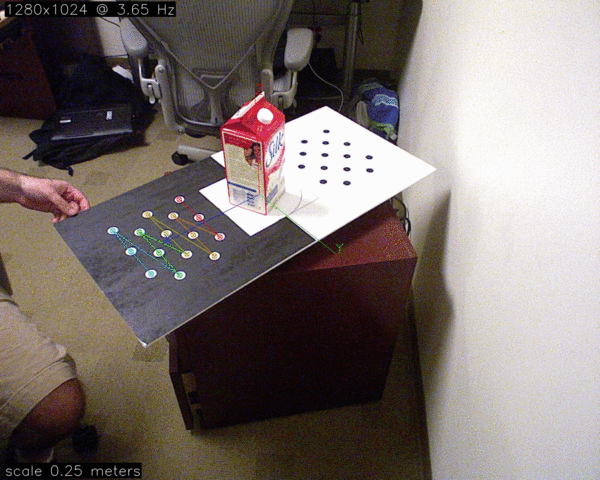

Data Capture
============

.. contents::

Object capture tools.

Capture setup
-------------
Capture is view based, and requires a fiducial that is rigidly attached to
the object being observed.  This enables relatively accurate view point pose estimation,
a consistent object coordinate frame, and simple object/background segmentation.
The setup also assumes that you have an RGB Depth device, such as the Kinect.

.. _capture_board:

The fiducial currently used for object capture is available for
download here: :download:`capture_board_big_5x3.svg`

.. figure:: capture_board_big_5x3.svg.png

  The default capture board uses circle pattern based fiducial markers,
  one black on white, the other inverted, so that two may be detected in
  the scene and allow for pose estimation even in the presence of occlusion.

Get a full size printing of the above fiducial marker and mount it to flat surface,
possibly on a lazy susan. http://en.wikipedia.org/wiki/Lazy_Susan

.. todo:: Support many sizes/types of fiducial markers through parameters.

The ROS drivers for openni are used to capture a view sparse bag of data.
Please make sure you are on ``electric`` or the drivers.

See http://www.ros.org/wiki/electric/Installation/Ubuntu and http://ros.org/wiki/openni
for detailed instructions.

.. highlight:: ectosh

ROS openni driver startup
-------------------------

Start up the ros openni driver:

::

  % roslaunch openni_launch openni.launch

Please make sure that the depth_registration mode for the driver is set to true.
::::::::::::::::::::::::::::::::::::::::::::::::::::::::::::::::::::::::::::::::

  % rosrun dynamic_reconfigure dynparam set /camera/driver depth_registration True

It may be preferable to use the SXGA (roughly 1 megapixel) mode of your openni device.

::

  % rosrun dynamic_reconfigure dynparam set /camera/driver image_mode 1

openni_capture.py
-----------------

You should use the openni_capture.py application to capture a bag of data that may
be used by object recognition.

.. program-output:: openni_capture.py --help
   :in_srcdir:

You should have the object placed statically on the fiducial marker the entire capture
session.  Press 'q' or ctrl-c to finish capturing.

::
  
  % apps/openni_capture.py -o silk_highres.bag
  [ INFO] [1314658330.134905171]: Initialied ros. node_name: /openni_capture
  Listening for key: s on imshow:save
  Threadpool executing [unlimited] ticks in 8 threads.
  [ INFO] [1314658330.149231645]: Subscribed to topic:/camera/rgb/camera_info with queue size of 0
  [ INFO] [1314658330.151197556]: Subscribed to topic:/camera/depth_registered/image with queue size of 0
  [ INFO] [1314658330.153270161]: Subscribed to topic:/camera/rgb/image_color with queue size of 0
  [ INFO] [1314658330.155347637]: Subscribed to topic:/camera/depth_registered/camera_info with queue size of 0
  Opening bag: bags/silk_highres2.bag
  ... etc ...

You should see an popup image similar to the following:

  A sample sequence of view captured using an opposing dot pattern fudicial marker.

bag_upload.py
-------------
Once you have captured a raw bag its time to upload it to the database.

For this we will use bag_upload.py. The help:

.. program-output:: bag_upload.py --help
   :in_srcdir:

A typical command line session will look like::

  % apps/bag_upload.py -i silk_highres.bag -n 'silk' -d 'A carton of Silk brand soy milk.' -a 'Ethan Rublee' -e 'erublee@willowgarage.com' --commit milk, soy, kitchen, tod
  Uploaded bag has id = 46d8611570108b1aa9ea049f7b998687

Now that the bag is uploaded, into the database, you can see it in the db by browsing to:

  * http://localhost:5984/_utils/database.html?objects
  * http://localhost:5984/_utils/database.html?bags

If you leave off the ``--commit`` the script will run without actually committing anything to
the database.

